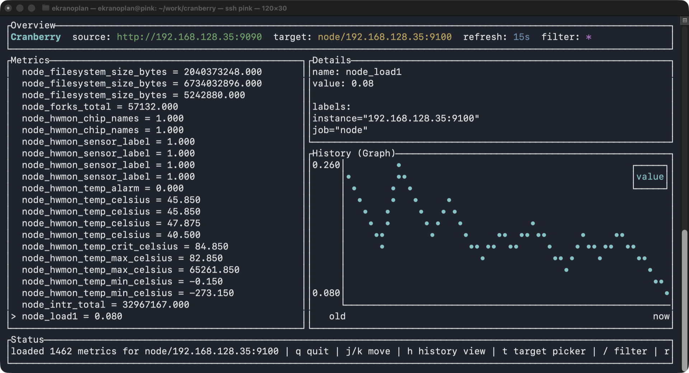

# Cranberry

Cranberry is a Rust TUI dashboard for browsing metrics from Prometheus through the Prometheus HTTP API.
It can also stream logs from Loki in a dedicated screen.



Japanese README: [README-ja.md](README-ja.md)

## Run

```bash
cargo run
```

If `cranberry.toml` exists, it is loaded automatically.

You can also override the Prometheus base URL on the command line:

```bash
cargo run -- http://127.0.0.1:9090
```

Or choose a different config file:

```bash
cargo run -- --config /path/to/cranberry.toml
```

## Configuration

Example `cranberry.toml.sample`:

```toml
[prometheus]
base_url = "http://127.0.0.1:9090"

[loki]
base_url = "http://127.0.0.1:3100"
host_label = "host"
log_label = "job"
poll_secs = 1
lookback_secs = 300

[display]
max_metrics = 20
initial_metric = "up"
refresh_secs = 15

[logging]
path = "cranberry.log"
level = "info"
```

Supported options:

- `prometheus.base_url`: Base URL for the Prometheus server, for example `http://127.0.0.1:9090`
- `display.max_metrics`: Optional cap for the metric list after target and text filtering
- `display.initial_metric`: Optional metric name to select initially
- `display.refresh_secs`: Automatic refresh interval in seconds
- `loki.base_url`: Base URL for the Loki server. Defaults to `http://127.0.0.1:3100`
- `loki.host_label`: Label name used for host selection. Defaults to `host`
- `loki.log_label`: Label name used for log selection. Defaults to `job`
- `loki.poll_secs`: Poll interval for log updates in seconds. Defaults to `1`
- `loki.lookback_secs`: Initial log lookback window in seconds. Defaults to `300`
- `logging.path`: Log file path. Defaults to `cranberry.log`
- `logging.level`: Log verbosity. One of `trace`, `debug`, `info`, `warn`, `error`. Defaults to `info`

If `prometheus.base_url` is omitted, Cranberry starts with built-in sample metrics.

## Controls

- `q`: Quit
- `j` / `k`: Move selection
- `[` / `]`: Switch target
- `t`: Open target picker
- `l`: Open Loki log viewer
- `/`: Open metric filter input
- `r`: Reload immediately
- `Tab` / `h` / `l` in log view: Switch between host and log pickers
- `Esc`: Close target picker, filter input, or log view
- `Enter`: Apply target picker selection or close filter input
- `Backspace`: Delete one character in filter input
- `Ctrl-U`: Clear filter input
